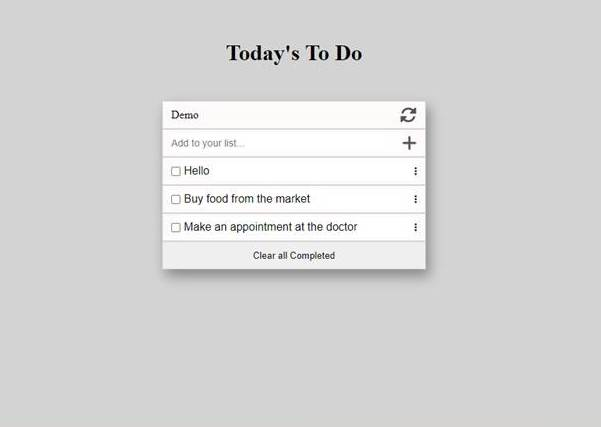

# To Do list

> Microverse project for practicing javascript coding skills..

Additional description about the project and its features

## Built With

- HTML
- CSS
- Javascript

## Live Demo

[Live Demo Link]()

## Getting Started

To get a local copy up and running follow these simple example steps.

### Setup
clone repo: `https://github.com/BereketRetta/TodoList_Jest.git`

### Install
run `npm install` to install dependencies

## Authors

👤 **Author**

- GitHub: [@bekiretta](https://github.com/bereketretta)
- Twitter: [@bekiretta](https://twitter.com/bekiopia)
- LinkedIn: [@bekiretta](https://www.linkedin.com/in/BereketRetta/)

## 🤝 Contributing

Contributions, issues, and feature requests are welcome!

Feel free to check the [issues page](../../issues/).

## Show your support

Give a ⭐️ if you like this project!

## Acknowledgments

- Hat tip to anyone whose code was used
- Inspiration
- etc

## 📝 License

This project is [MIT](./MIT.md) licensed.
